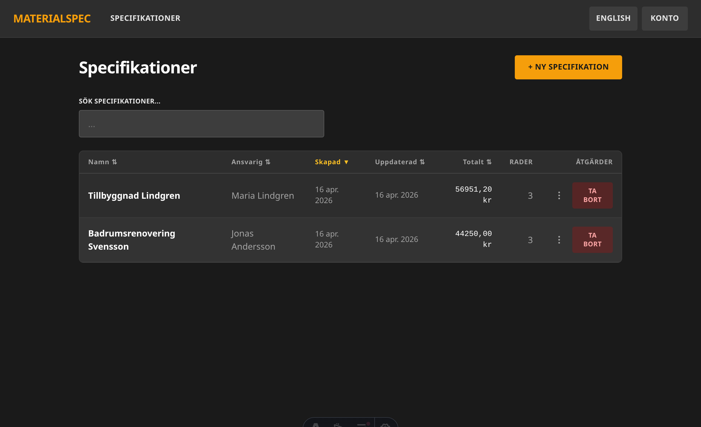

# Materialspec

> A purpose-built web application for Swedish construction companies to create, manage, and export material cost specifications.



---

## What it does

Construction estimators spend too much time fighting spreadsheets. Materialspec gives them a fast, keyboard-friendly alternative:

- **Build estimates** — add line items with name, unit, quantity, and price; VAT is calculated automatically per Swedish tax brackets (25%, 12%, 6%, 0%)
- **Tab through rows** — pressing Tab on the last price field creates a new row instantly; no mouse required
- **Drag to reorder** — grab any row and move it; keyboard-accessible too (Space + arrows)
- **Live totals** — see net, VAT, and gross grouped by tax bracket as you type
- **Export** — download a formatted Excel sheet or PDF with one click
- **Bilingual** — full Swedish and English UI; switch per user preference

---

## Tech stack

| Layer | Technology |
|-------|-----------|
| API | Hono + tRPC + Drizzle ORM |
| Database | PostgreSQL 16 |
| Auth | Lucia v3 (session cookies, argon2) |
| Frontend | Astro v5 SSR + React 19 islands |
| Styling | TailwindCSS (dark industrial theme) |
| Export | ExcelJS (xlsx) + PDFKit (pdf) |
| i18n | i18next — Swedish default, full English parity |
| Infrastructure | Docker Compose (single command startup) |

---

## Quick start

### Prerequisites
- Docker Desktop (or Docker Engine + Compose plugin)

### 1. Configure environment

```bash
cp .env.example .env
```

Edit `.env` and set:

```env
SESSION_SECRET=<64 random characters>
ADMIN_EMAIL=admin@yourcompany.com
ADMIN_INITIAL_PASSWORD=<your initial admin password>
```

The API port defaults to `3721` — `API_HOST_PORT` and `PUBLIC_API_URL` must match:

```env
API_HOST_PORT=3721
PUBLIC_API_URL=http://localhost:3721
```

### 2. Start the stack

```bash
docker compose -f docker-compose.yml -f docker-compose.dev.yml --profile dev up --build
```

| Service | URL |
|---------|-----|
| Web app | http://localhost:4321 |
| API | http://localhost:3721 |
| Adminer (DB) | http://localhost:8080 |

Migrations run automatically on startup. The admin user is created from the env vars — log in at http://localhost:4321/sv/login.

---

## Project structure

```
materialspec/
├── apps/
│   ├── api/          # Hono + tRPC server
│   └── web/          # Astro SSR frontend
├── packages/
│   └── shared/       # Zod schemas, VAT constants, money utils, i18n JSON
├── docker-compose.yml
└── .env.example
```

`packages/shared` is the single source of truth for validation schemas, domain constants, and translation files. Both the API and frontend consume it directly.

---

## Development

```bash
# Type-check all workspaces
tsc --build

# Run E2E tests (requires stack running)
cd apps/web && npx playwright test

# Generate a DB migration after schema changes
npm run drizzle:generate --workspace=@materialspec/api
```

Hot reload is active in dev mode — editing source files inside the containers triggers automatic restarts.

---

## For AI agents

See [`AGENTS.md`](AGENTS.md) for a self-contained guide covering architecture, conventions, known bugs, and domain rules. Claude Code loads additional detail from [`docs/agent/`](docs/agent/) via [`CLAUDE.md`](CLAUDE.md).
